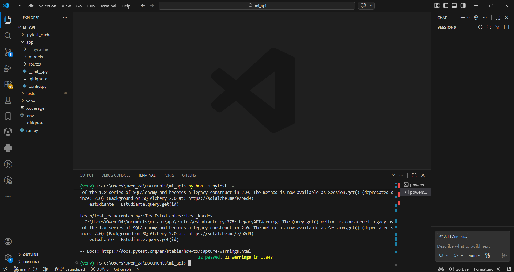

# 📘 Proyecto API Flask - Pruebas Automatizadas

## 📌 Descripción

Este proyecto consiste en una API desarrollada con Flask para la gestión de estudiantes, materias, calificaciones y autenticación de usuarios.

Se implementaron **pruebas automatizadas utilizando pytest** para validar el correcto funcionamiento de los módulos del sistema.

---

## ⚙️ Tecnologías utilizadas

* Python 3.14
* Flask
* Flask-SQLAlchemy
* Flask-JWT-Extended
* Flask-Migrate
* Flask-CORS
* Pytest
* Pytest-Flask
* Pytest-Cov
* Factory-Boy
* Faker

---

## 📦 Instalación y configuración

### 1. Clonar el repositorio

```bash
git clone <URL_DEL_REPOSITORIO>
cd mi_api
```

---

### 2. Crear entorno virtual

```bash
python -m venv venv
```

---

### 3. Activar entorno virtual

```bash
.\venv\Scripts\activate
```

---

### 4. Instalar dependencias

```bash
pip install pytest pytest-flask pytest-cov factory-boy faker
pip install flask-sqlalchemy flask-migrate flask-jwt-extended psycopg2-binary
pip install flask-cors python-dotenv flasgger
```

---

## ▶️ Ejecución de pruebas

Para ejecutar todas las pruebas:

```bash
python -m pytest -v
```

---

## ✅ Resultados obtenidos

Se ejecutaron un total de **12 pruebas automatizadas**, obteniendo el siguiente resultado:

```bash
================================================
12 passed, 21 warnings in 1.84s
================================================
```



---

✔ Todas las pruebas fueron exitosas
✔ El sistema funciona correctamente
✔ Se validaron los módulos principales de la API

---

## 🧪 Pruebas realizadas

Las pruebas cubren los siguientes módulos:

* 🔐 Autenticación

  * Registro de usuario
  * Inicio de sesión

* 👨‍🎓 Estudiantes

  * Crear estudiante
  * Listar estudiantes
  * Obtener estudiante
  * Actualizar estudiante
  * Eliminar estudiante
  * Consultar kardex

* 📚 Materias

  * Crear materia
  * Listar materias

* 📝 Calificaciones

  * Registrar calificación

* 🧩 Modelos

  * Creación de entidades en base de datos

---

## 📊 Cobertura de pruebas (opcional)

Para ejecutar pruebas con cobertura:

```bash
python -m pytest --cov=app
```

---

## ⚠️ Observaciones

Durante la ejecución se generaron algunos *warnings*:

* Uso de claves JWT cortas (recomendación de seguridad)
* Uso de métodos legacy en SQLAlchemy

Estos no afectan el funcionamiento del sistema.

---

## 🎯 Conclusión

El sistema fue probado exitosamente mediante pruebas automatizadas, garantizando que:

* La API responde correctamente
* Los endpoints funcionan como se espera
* La lógica de negocio es válida

---

## 👨‍💻 Autor

Luis Owen Jaramillo Guerrero
